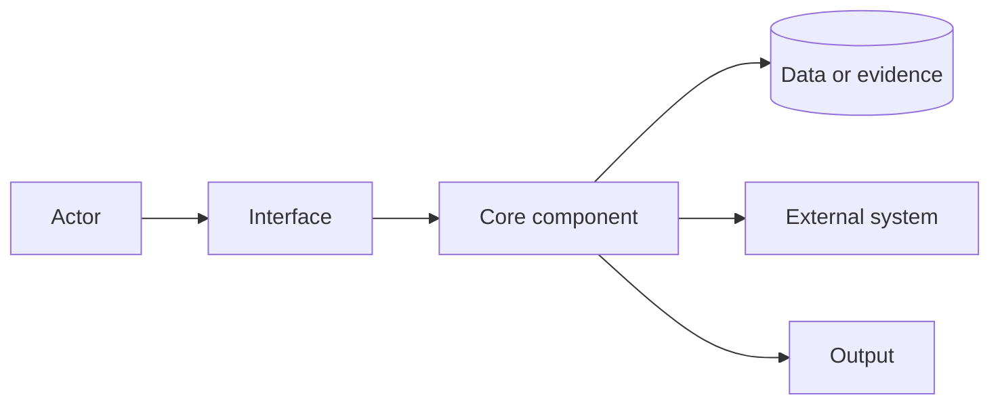
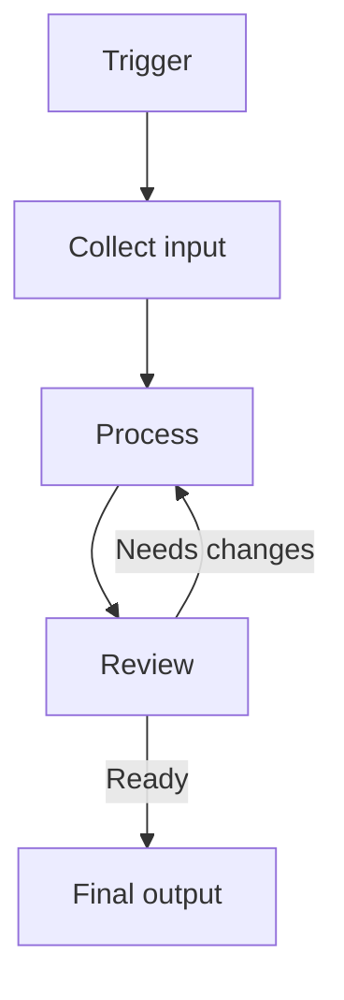
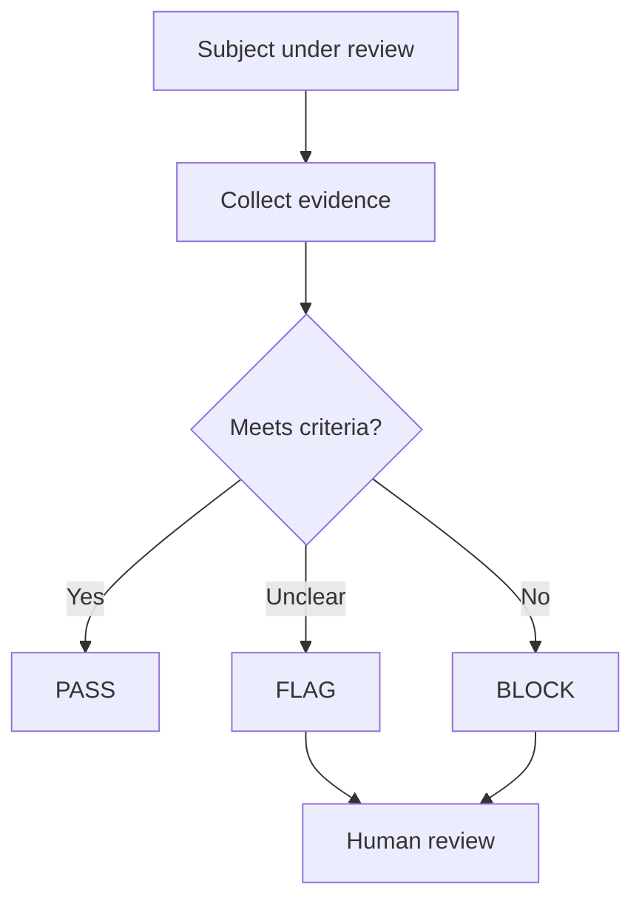

# Diagram Templates

Use one template per diagram unless the user asks for alternatives.

## system-map

Use for architecture, products, agents, services, databases, APIs, local tools, and integrations.

Slots:
- Main user or actor
- Primary interface
- Core processing components
- Evidence, data, or storage
- External systems
- Output or decision

Starter:

Quality check:
- Boundaries are visible.
- Data or evidence sources are not hidden.
- External systems are separate from local components.

## workflow

Use for step-by-step processes, editorial flows, delivery pipelines, handoffs, and feedback loops.

Slots:
- Trigger
- Input
- Processing steps
- Review or validation step
- Revision loop
- Final output

Starter:

Quality check:
- The sequence can be followed top to bottom.
- Review loops return to the step that can fix the issue.
- Each step has one responsibility.

## decision-flow

Use for gates, validation, policies, judge agents, triage, routing logic, and PASS / FLAG / BLOCK outcomes.

Slots:
- Subject under review
- Evidence collection
- Decision criteria
- Pass branch
- Flag branch
- Block branch
- Human or owner decision

Starter:

Quality check:
- Each branch has a condition label.
- PASS, FLAG, and BLOCK mean different things.
- Human judgment is shown when the automated result is advisory.
